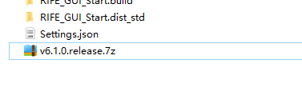
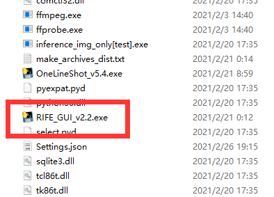
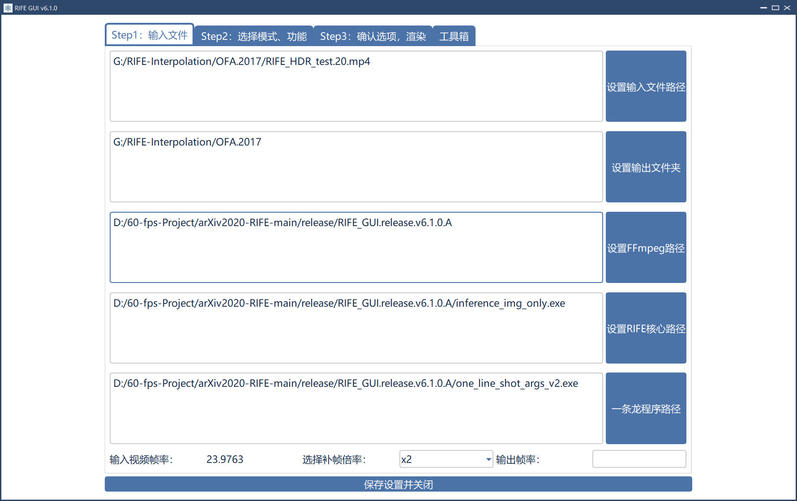
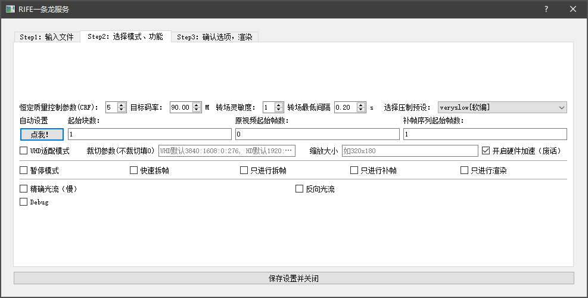
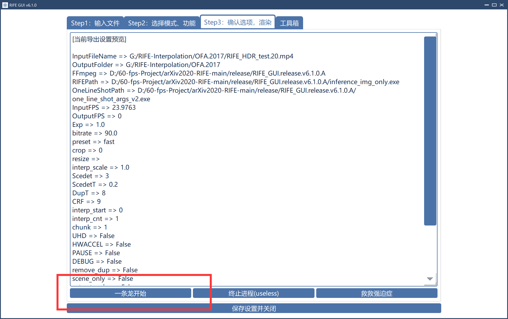

# RIFE_GUI
Python Scripts (CLI tool with GUI) for RIFE batch process (Mainly for interpolation of long movies or video materials with cuts)

## *Usage 使用*:
### *Preparation 非编译版本*
#### 1. Clone this Repository 克隆这个库
#### 2. Clone [RIFE](https://github.com/hzwer/arXiv2020-RIFE) 克隆RIFE库
#### 3. Follow RIFE's instructions and download assigned datasets 根据RIFE库的操作指引自行搭建python环境
## *Run 运行*
### 1. GUI tool 可视化工具
built by PyQt5, easy to launch, CUDA ONLY!!!!!!!
#### Handful Guide for v5.4.0 Release 快速操作指引:
##### a. Extract 7z file to an empty folder 将release 7z压缩包解压到仅英文路径的文件夹

##### b. launch RIFE_GUI.exe 启动RIFE_GUI.exe

##### c. Fill in related parameters, follow the step from 1 to 2 to 3 输入相关参数


##### d. Press One-Line-Shot button and wait for output, which is really easy 按“一条龙开始”按钮，等待成品输出

##### e. Error handle
if you could not find "concat_all.mp4" in your output folder, restart RIFE_GUI.exe and use "RIFE_ONLY" at STEP 2 to create the last chunk of interpolated product.

### 2. CLI tool 命令行工具
#### 1. Command Shortcut: 命令帮助 
```
python3 one_line_shot_args.py -h
```
*For Latest Update: 最新版本：*
```
usage: #### RIFE Step by Step CLI tool/补帧分步设置命令行工具 from Jeanna ####
       [-h] -i INPUT -o OUTPUT [--rife RIFE] [--ffmpeg FFMPEG] [--fps FPS]
       [--target-fps TARGET_FPS] -r {1,2,3} [--chunk CHUNK]
       [--interp-start INTERP_START] [--interp-cnt INTERP_CNT] [--hwaccel]
       [--model MODEL] [--UHD] [--debug] [--pause] [--quick-extract]
       [--extract-only] [--rife-only] [--render-only] [--accurate] [--reverse]
       [--scdet SCDET] [--scdet-threshold SCDET_THRESHOLD]
       [--UHD-crop UHDCROP] [--HD-crop HDCROP] [--resize RESIZE] [-b BITRATE]
       [--preset PRESET] [--crf CRF]

Interpolation for sequences of images

optional arguments:
  -h, --help            show this help message and exit

Basic Settings, Necessary:
  -i INPUT, --input INPUT
                        原视频路径, 补帧项目将在视频所在文件夹建立
  -o OUTPUT, --output OUTPUT
                        成品输出的路径，注意默认在项目文件夹
  --rife RIFE           inference_img_only.py的路径
  --ffmpeg FFMPEG       ffmpeg三件套所在文件夹
  --fps FPS             原视频的帧率, 默认0(自动识别)
  --target-fps TARGET_FPS
                        目标视频帧率, 默认0(fps * 2 ** exp)

Step by Step Settings:
  -r {1,2,3}, --ratio {1,2,3}
                        补帧系数, 2的几次方，23.976->95.904，填2
  --chunk CHUNK         新增视频的序号(auto)
  --interp-start INTERP_START
                        用于补帧的原视频的帧序列起始帧数，默认：0
  --interp-cnt INTERP_CNT
                        成品帧序列起始帧数
  --hwaccel             支持硬件加速编码(想搞快点就用上)
  --model MODEL         Select RIFE Model, default v2

Preference Settings:
  --UHD                 支持UHD补帧
  --debug               debug
  --pause               pause, 在各步暂停确认
  --quick-extract       快速抽帧
  --extract-only        只进行帧序列提取操作
  --rife-only           只进行补帧操作
  --render-only         只进行渲染操作
  --accurate            精确补帧
  --reverse             反向光流

Output Settings:
  --scdet SCDET         转场识别灵敏度，越小越准确，人工介入也会越多
  --scdet-threshold SCDET_THRESHOLD
                        转场间隔阈值判定，要求相邻转场间隔大于该阈值
  --UHD-crop UHDCROP    UHD裁切参数，默认开启，填0不裁，默认：3840:1608:0:276
  --HD-crop HDCROP      QHD裁切参数，默认：1920:804:0:138
  --resize RESIZE       ffmpeg -s 缩放参数，默认不开启（为空）
  -b BITRATE, --bitrate BITRATE
                        成品目标(最高)码率
  --preset PRESET       压制预设，medium以下可用于收藏。硬件加速推荐hq
  --crf CRF             恒定质量控制，12以下可作为收藏，16能看，默认：9
```
#### 2. Example 操作样例
```
python3 one_line_shot_args.py -i <input_video> --rife <path of inference_img_only.py> \-r 2 --output <output_video>  --fps 24000/1001 --preset hq --hwaccel --crf 6 --UHD  --start 1 --chunk 1 --ffmpeg ffmpeg
```
*which means follow operation: 上述命令等同于*
1. Input a 23.976 fps video with UHD contents (formats specifically assigned to **-color_range tv -color_primaries bt2020 -color_trc smpte2084 -colorspace bt2020nc**)
输入帧率为23.976带HDR内容的视频素材
2. Interpolate the footage 4 times with exp(ratio)=2 from 23.976 fps to 95.904 fps
并将其4倍补帧输出95.904fps的视频
3. Assign encode presets of ffmpeg as "hq"(for encoder **hevc_nvenc**, note that HDR metadata will not be written in this case)
指定ffmpeg压制预设为hevc_nvenc的hq
4. Assign **crf** for ffmpeg as 6
指定恒定质量控制参数为6
5. start the interpolation process from **frame 1, chunk 1** to the end
从原视频帧序列的第一帧，输出块序号为1开始运行
#### 3. Output
*output chunk(.mp4) is named after following rules*
*输出的视频块数按照以下规则命名*
```
chunk-<chunk count>-<start frame count>-<end frame count>.mp4
```
e.g. chunk-001-00000001-00001466.mp4
### 3. Other tools
measure.py, handy scripts for measuring two images(for inferenced imgs)
### 4. Notes:
English/Chinese usages on fly
### 5. Known Issues 已知问题:
a. The interpolated video may be 5 frames longer than the original. You could use Davinci Resolve to clean out those frames.
####
b. False frames at video transition. No once-fixed-up solution for this, cutting tool is involved for best PERFORMANCE.
由于对于不同素材转场识别灵敏度会有变化，在导出成品的转场处可能会出现坏帧，因此建议多多调试Step2的转场灵敏度和转场最低间隔以获取尽可能多的转场。
另，在提取转场过程中，可手动删除补帧文件夹里的转场图片以去掉被识别为转场的非转场时间点
### 6. Reference & Acknowledgement
Video interpolation method: [RIFE](https://github.com/hzwer/arXiv2020-RIFE)

RIFE GUI Assembly: [Squirrel-Video-Frame-Interpolation](https://github.com/YiWeiHuang-stack/Squirrel-Video-Frame-Interpolation/stargazers)
